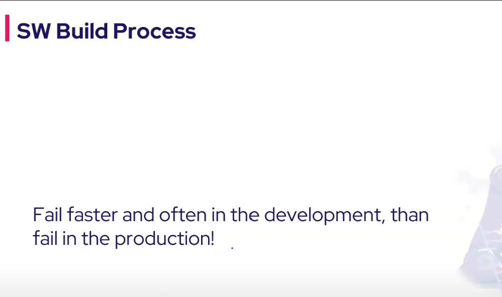

# Jenkis

**Learning Material:**

- Devops
  - Name : Jenkins Series 2024
  - Link : https://www.youtube.com/watch?v=4QvXynIrPQo&list=PL8klaCXyIuQ5bSEMP8bfau_XzVko7TGsr&index=1
  - Price : 750 THB/month
  - Learning interval :

**Objective:**

- Fundamental knowledge about jenkins.
- Can setup jenkins pipeline.
- Can setup jenkins server.

# 1. Introduction to SDCL, CICD and GitOps | Continuous Delivery vs Deployment | Various CI Tools

## 1.1 SW Build Process

- Rely on dependencies

### 1.1.1 Build Automation

- Shell scripy /automation. But it not standard way.
- Build tool help like MAVEN. Can generate project.
- But in some landguage have no BUILD TOOL ?

### 1.1.2 Fail Fast

- Fail fast get feedback fast.

## 2.1 Phase in CI/CD

- Common stage. Build -> test -> deploy

**CI/CD**

- If we make merge evey week it will be more good ?

**Continuous Integration**

- Integrate chnage back to main branch.
  - When integrate to main branch the build. When finish it will be merge to main branch.
  - Example. Validation code.
- main : branch of truth.
  - have to mr/pr to this main branch.

- Webhook
  - 2 applciation talk asynchronously
  - Github is sending req to jenkins
  - Method
    - Push based method
      - Some event occur in Github side it will push noti to jenkins.
    - Pull based method (additional)
      - Always fetching for data.
  - Webhook We can setup in github repo.
  - Can make CI send message or comment back after the pr.

**Continuous Testing**

- Security scan
  - Dependencies

**Continuous Delivery**

**Continuous Deployment**

**Continuous Delivery vs Deployment**

- Continuous Delivery : Manual deploy
- Continuous Deployment : Automate deploy

**CI/CD Tool**

**How does CICD relate to DevOps**

**What is GitOps**

- 2 repo
  1. Code
  2. Configuration

**Argocd**

- GitOps operator
  - Check the config repo does it any change.
  - If there are cahnge it will do a rollout.

# 2. Jenkins Introduction | Master Slave Architecture | Jenkins Plugins

## 2.1 Jenkin Introduction

- Plugin is use for interact with other software.
  - It make easy to talk with the external tool.
  - Example. Docker build we can use docker plugin.
- Master-slave
  - Very important

**Jenkin History**

**Jenkins Capabilities**

**CICD pipeline**

**Jenkins plugins**

- Can manually download for no internet access.
  - Problem is we have to know all dependent plugins.

**Jenkins Master-Slave Architecture**

- Component
  - Master :
    - Do admin task.
    - Select node for specific job.
      - Select node(slave) by labels.
  - Slave :
    - All task share to slave.
    - Slave dont have to have Jenkins installed. But Have to have AGENT running.
    - Agent :
      - reponsible for taking instruction from master node.
      - Developed in java.
- Agent type:
  1. Node : cloud agent
  2. Container :
  - Reduce problem on installing dependencies.
  - Example use ECS as Agent.
  - Disadvantage:
    - If we have multiple dependencies in one pipeline.
      - Solve : Use Pod because can have multiple container.
        
        - Pod as a agent.
        - Which are temporary.
        - JNLP : extra container that will be automatically injected by your master controller.
